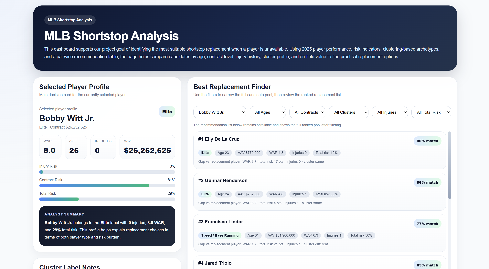

# MLB Shortstop Replacement Finder

An interactive baseball analytics tool that identifies and ranks potential MLB shortstop replacements using player archetypes, playing-style similarity, performance, and acquisition risk.

[Launch the Interactive Dashboard](https://gregoryheiger.github.io/MLB-Shortstop-Archetypes/)

## Project Overview

Major League Baseball teams frequently need to replace a shortstop because of injury, free agency, trade, or performance decline. Traditional comparisons often focus heavily on overall metrics such as WAR, but players with similar value can contribute in very different ways.

This project treats replacement as a multidimensional decision problem. The tool evaluates:

* How a player creates value
* Similarity in playing style
* Offensive, defensive, and baserunning archetypes
* Age risk
* Injury history
* Contract burden
* Team-specific constraints and preferences

Rather than simply identifying the “best” available player, the dashboard helps users identify the most practical fit for the player and roster being evaluated.

## Dashboard Features

The interactive dashboard allows users to:

* Select an MLB shortstop to replace
* Review the selected player’s archetype and risk profile
* View a ranked list of replacement candidates
* Compare match percentage, WAR, age, contract value, injuries, and total risk
* Filter candidates by age, contract level, archetype, injury history, and risk
* Search for either a similar player type or a strategically different roster fit

## Data

The analysis uses player-season data from 2023 through 2025.

Primary sources:

* Baseball Savant and Statcast performance data
* FanGraphs contract information
* FanGraphs injury information

More than 200 initial variables were reduced to 15 final performance features across four dimensions:

* Power
* Contact
* Speed and baserunning
* Defense

## Methodology

Four clustering methods were evaluated:

* K-means
* Gaussian mixture models
* K-medoids
* Spectral clustering

The final model uses spectral clustering with five interpretable player archetypes:

1. Elite
2. Speed/Baserunning
3. Contact
4. Power/Defense
5. Balanced

Candidate recommendations combine player-profile similarity with a composite risk framework based on age, injury history, and contract burden.

The final score places greater weight on playing-style similarity while using risk as a feasibility adjustment.

## Why This Project Matters

Two shortstops can produce similar overall value while serving very different roster roles. A team replacing a speed-and-contact player may not want the same candidate as a team replacing a power-and-defense player.

This tool moves beyond one-dimensional rankings by combining statistical similarity, player archetypes, and real-world acquisition considerations in one accessible interface.

## Key Limitations

* The current tool evaluates only MLB shortstops
* Recommendations use the 2025 player pool
* Trade availability and acquisition cost are not modeled directly
* Injury duration is approximated using injured-list records
* Minor-league and prospect options are not yet included

## Future Development

Potential extensions include:

* Expanding the model to additional positions
* Adding minor-league and prospect players
* Incorporating trade availability and estimated acquisition cost
* Improving injury-risk modeling
* Updating the player pool for future seasons
* Expanding the dashboard into a broader roster-planning platform

## Project Report

[View the Full Project Report](Oraven-MLB-Shortstop-Replacement-Final-Report.pdf)

## Team

This project was developed as a collaborative Johns Hopkins University project by:

* Gregory Heiger
* Jangmin Song
* Ke Xu
* Wenhao Ma
* Helin Li

### My Contributions

* Project framing and baseball decision context
* Data preparation and feature selection
* Clustering evaluation and interpretation
* Risk-model development
* Recommendation methodology
* Report writing and presentation

## Tools and Technologies

* Python
* pandas
* NumPy
* scikit-learn
* Statistical clustering
* Principal component analysis
* Baseball Savant / Statcast
* FanGraphs
* HTML, CSS, and JavaScript
* Interactive data visualization

## Contact

**Gregory Heiger**
B.S. Applied Mathematics and Statistics, Johns Hopkins University
[LinkedIn](https://www.linkedin.com/in/gregory-heiger-4569a2350/) | [GitHub](https://github.com/GregoryHeiger)
